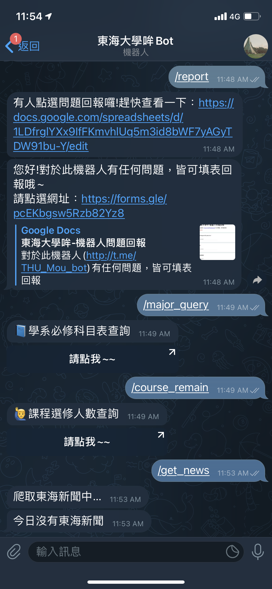
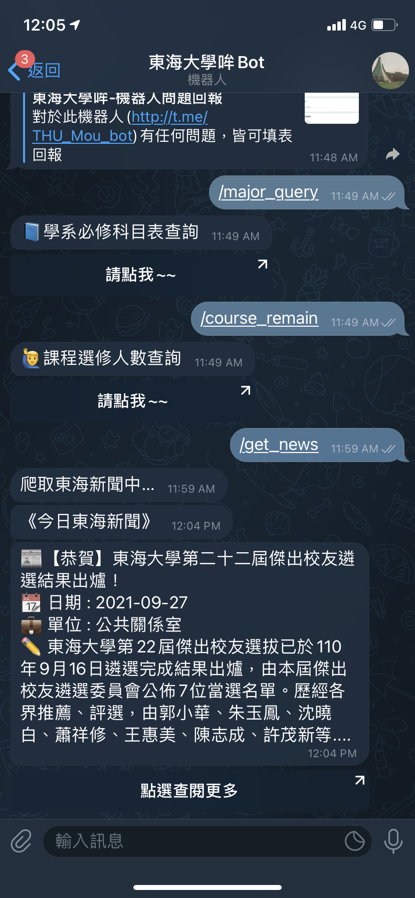
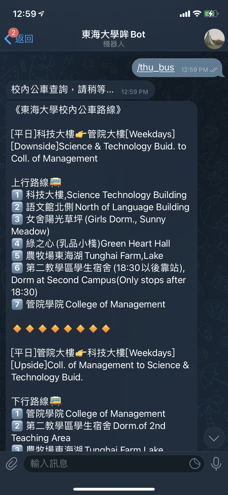
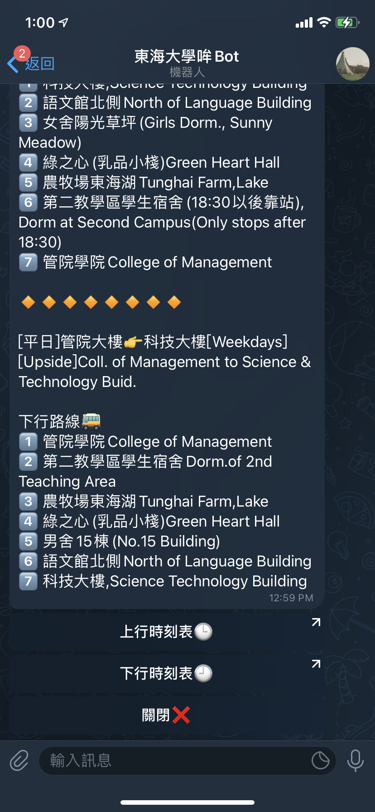

## Telegram Bot - 東海大學哞🤖️
- [網址](https://t.me/THU_mou_bot)

### 目前功能
- ping - 針測機器人是否活著
- thu_bus - 校內公車查詢(只可查詢假日時間之班次)
- report - 問題回報
- major_query - 學系必修科目表查詢
- course_query - 開課明細查詢
- course_remain - 課程選修人數查詢
- phonebook - 東海聯絡簿

### Demo
- [Video](assets/demo.MP4)
- ScreenShot
  - 
  - 
  - 

### Log
- [Log 紀錄](./Log.md)

### 參考資源
- [node-telegram-bot-api](https://github.com/yagop/node-telegram-bot-api)
- [node-telegram-bot-api-tutorial](https://github.com/hosein2398/node-telegram-bot-api-tutorial)
- [Telegram Bot API 2.0](https://core.telegram.org/bots/2-0-intro)

